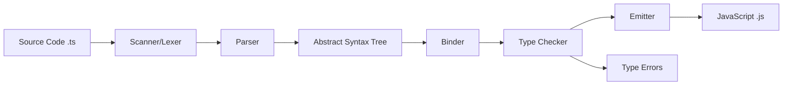

# TypeScript & Vue 3 Mastery

A Deep Dive into Modern Type-Safe Development

<div class="pt-12">
  <span @click="$slidev.nav.next" class="px-2 py-1 rounded cursor-pointer" hover="bg-white bg-opacity-10">
    Press Space for next page <carbon:arrow-right class="inline"/>
  </span>
</div>

---
layout: intro
---

# What We'll Cover Today

<v-clicks>

- 📚 **TypeScript History** - From inception to modern day
- 🔥 **Complete Type System** - Every TypeScript feature
- 🛠️ **Real-World Applications** - API generation, forms, CI/CD
- 🎨 **Vue 3 Integration** - Type-safe components
- 💻 **Live Coding** - Build something together

</v-clicks>

---
layout: section
---

# Part 1: TypeScript History & Evolution

---

# The Birth of TypeScript

<v-clicks>

## Origins (2012)

- **Created by**: Anders Hejlsberg at Microsoft
- **Why**: JavaScript at scale was painful
  - No IDE support
  - No type checking
  - Difficult refactoring
  - Runtime errors everywhere

## The Problem It Solved

```javascript
// JavaScript - 2012
function greet(person) {
  return "Hello, " + person.name; // What if person is null? What if no name property?
}
```

```typescript
// TypeScript - The solution
function greet(person: { name: string }): string {
  return `Hello, ${person.name}`; // Guaranteed to be safe!
}
```

</v-clicks>

---

# TypeScript Evolution Timeline

<v-clicks>

## Major Milestones

- **October 2012**: TypeScript 0.8 announced
- **April 2014**: TypeScript 1.0 - Production ready
- **September 2016**: TypeScript 2.0 - Null checking, readonly
- **July 2018**: TypeScript 3.0 - Project references, tuples
- **August 2020**: TypeScript 4.0 - Variadic tuples, labeled tuples
- **November 2023**: TypeScript 5.0 - Decorators, const type parameters
- **Today**: TypeScript 5.9+ - Latest stable release

## Adoption Growth

- Used by **78%** of JavaScript developers
- **Microsoft**, **Google**, **Facebook**, **Airbnb** use it
- Over **90% of npm packages** have type definitions
- De facto standard for large-scale JavaScript

</v-clicks>

---

# Static vs Dynamic Typing

<v-clicks>

## What is a Statically-Typed Language?

A **statically-typed** language checks types **at compile time** (before running the code).

### Key Characteristics:
- ✅ **Type checking happens before execution**
- ✅ **Types are known at compile time**
- ✅ **Catches errors early in development**
- ✅ **Better IDE support** (autocomplete, refactoring)
- ✅ **Documentation built into code**

<br>

### Examples:
- **TypeScript**, **Java**, **C++**, **C#**, **Rust**, **Go**

</v-clicks>

---

# Static vs Dynamic Typing

<v-clicks>

## What is a Dynamically-Typed Language?

A **dynamically-typed** language checks types **at runtime** (while the code is executing).

### Key Characteristics:
- ⚠️ **Type checking happens during execution**
- ⚠️ **Types can change at runtime**
- ⚠️ **Errors discovered while running**
- ⚠️ **More flexible but less safe**

### Examples:
- **JavaScript**, **Python**, **Ruby**, **PHP**

## The Trade-off

```typescript
// Static (TypeScript) - Error caught immediately in IDE
let count: number = 5;
count = "hello"; // ❌ Type 'string' is not assignable to type 'number'
```

```javascript
// Dynamic (JavaScript) - Error only at runtime (maybe never!)
let count = 5;
count = "hello"; // ✅ No error until you try to use it as a number
console.log(count + 10); // "hello10" - Surprise! 🐛
```

</v-clicks>

---

# TypeScript: The Transpiler

How TypeScript transforms into JavaScript

**TypeScript is a transpiler, not a traditional compiler**

<v-clicks>

## What `tsc` (TypeScript Compiler) Does:

1. **Type Checking** - Analyzes code for type errors
2. **Type Stripping** - Removes all type annotations
3. **Code Generation** - Outputs JavaScript


## Example Transformation:

**Input (TypeScript):**
```typescript
interface User {
  name: string;
  age: number;
}

function greet(user: User): string {
  return `Hello, ${user.name}!`;
}

const person: User = { name: "Alice", age: 30 };
greet(person);
```

**Output (JavaScript):**
```javascript
function greet(user) {
  return `Hello, ${user.name}!`;
}

const person = { name: "Alice", age: 30 };
greet(person);
```

**Note:** Types exist only at compile time, not runtime!

</v-clicks>

---

# TypeScript Compiler (tsc) - Under the Hood

How the TypeScript compiler works internally

<v-clicks>

## Compilation Pipeline:



## The Process:

1. **Scanner (Lexer)** - Breaks source code into tokens
   - Converts `function greet(name: string)` → `[function, greet, (, name, :, string, )]`

2. **Parser** - Builds Abstract Syntax Tree (AST)
   - Creates tree structure representing code syntax

3. **Binder** - Connects declarations and usage
   - Links variable references to their declarations

4. **Type Checker** - Analyzes types and validates code
   - Most complex part - performs type inference and validation
   - Detects type errors and reports diagnostics

5. **Emitter** - Generates JavaScript output
   - Strips types and emits `.js` and `.d.ts` files
   - Applies downleveling (ES6 → ES5, etc.)

## Type Checking Only: `tsc --noEmit`

**Skip code generation, only check types:**

```bash
tsc --noEmit
```

- ✅ **Runs Scanner, Parser, Binder, and Type Checker**
- ❌ **Skips Emitter** - No `.js` files generated
- ⚡ **Faster** - No file I/O for output
- 🎯 **Use Cases:**
  - **CI/CD pipelines** - Validate types before deployment
  - **Pre-commit hooks** - Catch type errors before commit
  - **With bundlers** - Let Vite/Webpack handle compilation
  - **Quick validation** - Check types during development

```bash
# Common usage
npm run type-check    # package.json: "tsc --noEmit"
tsc --noEmit --watch  # Watch mode for continuous checking
```

</v-clicks>

---

# TypeScript's Structural Type System

<v-clicks>

### Structural Typing (Not Nominal Typing)

TypeScript checks types **by structure**, not by name!

### What This Means:
- ✅ **Checks the shape/structure** of the data (properties & types)
- ✅ **Ignores interface/type names**
- ✅ **"Duck typing"** - If it looks like a duck and quacks like a duck...
- ❌ **NOT** like Java/C# where names must match exactly

## Example:

```typescript
interface Person {
  name: string;
  age: number;
}

function greet(person: Person): void {
  console.log(`Hello, ${person.name}!`);
}

// ✅ Works! Has the right structure (name: string, age: number)
const user = { name: "Alice", age: 30 };
greet(user);

// ✅ Also works! Even though it's not named "Person"
const employee = { name: "Bob", age: 25, role: "Developer" };
greet(employee); // Extra properties are OK!

// ❌ Error! Missing required property
const incomplete = { name: "Charlie" };
greet(incomplete); // Error: Property 'age' is missing
```

**TypeScript only cares that the object has AT LEAST the required properties with correct types!**

</v-clicks>

---

# TS Setup: Plain HTML/JS

Using TypeScript without bundlers

## Approach 1: Simple (No Config)

**Direct file compilation - `tsc` ignores tsconfig.json!**

<div class="grid grid-cols-2 gap-4">

<div>

**1. Install TypeScript:**
```bash
npm install -g typescript
```

**2. File Structure:**
```
project/
  ├── index.html
  ├── app.ts        ← Write TypeScript here
  └── app.js        ← Generated JavaScript
```

**3. Compile:**
```bash
# Single file (ignores tsconfig.json)
tsc app.ts

# Watch mode
tsc app.ts --watch
```

</div>

<div>

**index.html:**
```html
<!DOCTYPE html>
<html>
<head>
  <title>TypeScript App</title>
</head>
<body>
  <h1>Hello TypeScript!</h1>
  <script src="app.js"></script>
</body>
</html>
```

**app.ts:**
```typescript
const message: string = "Hello!";
console.log(message);
```

⚠️ **Note:** When you specify a file (`tsc app.ts`), TypeScript **ignores tsconfig.json** completely!

</div>

</div>

## Approach 2: With Config (Organized)

**Using tsconfig.json with src/ and dist/ folders**

<div class="grid grid-cols-2 gap-4">

<div>

**1. Initialize config:**
```bash
tsc --init
```

**2. File Structure:**
```
project/
  ├── index.html
  ├── tsconfig.json
  ├── src/
  │   └── app.ts    ← Write TypeScript here
  └── dist/
      └── app.js    ← Generated JavaScript
```

**3. Compile:**
```bash
# Compile all files (uses tsconfig.json)
tsc

# Watch mode (uses tsconfig.json)
tsc --watch
```

</div>

<div>

**tsconfig.json:**
```json
{
  "compilerOptions": {
    "target": "ES2020",
    "module": "ESNext",
    "outDir": "./dist",
    "rootDir": "./src",
    "strict": true,
    "esModuleInterop": true
  },
  "include": ["src/**/*"]
}
```

**index.html:**
```html
<!DOCTYPE html>
<html>
<head>
  <title>TypeScript App</title>
</head>
<body>
  <h1>Hello TypeScript!</h1>
  <!-- Load from dist folder -->
  <script src="dist/app.js"></script>
</body>
</html>
```

</div>

</div>

---

# TS Setup: Bundlers

Vite and Webpack with TypeScript

<div class="grid grid-cols-2 gap-4">

<div>

**Vite (Recommended)**

```bash
# Create project
npm create vite@latest my-app -- --template vanilla-ts

# Install dependencies
cd my-app && npm install

# Start dev server
npm run dev
```

**File Structure:**
```
project/
  ├── index.html
  ├── src/
  │   ├── main.ts       ← Entry point
  │   ├── style.css
  │   └── utils.ts
  ├── vite.config.ts
  ├── tsconfig.json
  └── package.json
```

**vite.config.ts:**
```typescript
import { defineConfig } from 'vite';

export default defineConfig({
  // Vite has built-in TS support!
  build: {
    target: 'es2020'
  }
});
```

**tsconfig.json:**
```json
{
  "compilerOptions": {
    "target": "ES2020",
    "module": "ESNext",
    "moduleResolution": "bundler",
    "strict": true,
    "skipLibCheck": true
  }
}
```

**index.html:**
```html
<!DOCTYPE html>
<html>
<body>
  <div id="app"></div>
  <!-- Vite auto-injects the script -->
  <script type="module" src="/src/main.ts"></script>
</body>
</html>
```

**Mini app example:**
```typescript
// src/main.ts
import { greet } from './utils';

const name: string = 'World';
const app = document.querySelector<HTMLDivElement>('#app')!;
app.innerHTML = greet(name);
```

</div>

<div>

**Webpack**

```bash
npm install --save-dev webpack webpack-cli \
  typescript ts-loader
```

**File Structure:**
```
project/
  ├── index.html        ← HTML entry
  ├── src/
  │   ├── index.ts      ← Entry point
  │   └── utils.ts
  ├── dist/             ← Build output
  │   └── bundle.js
  ├── webpack.config.js
  ├── tsconfig.json
  └── package.json
```

**webpack.config.js:**
```javascript
const path = require('path');

module.exports = {
  entry: './src/index.ts',
  module: {
    rules: [
      {
        test: /\.tsx?$/,
        use: 'ts-loader',
        exclude: /node_modules/
      }
    ]
  },
  resolve: {
    extensions: ['.tsx', '.ts', '.js']
  },
  output: {
    filename: 'bundle.js',
    path: path.resolve(__dirname, 'dist')
  }
};
```

**tsconfig.json:**
```json
{
  "compilerOptions": {
    "target": "ES2020",
    "module": "ESNext",
    "moduleResolution": "node",
    "strict": true,
    "skipLibCheck": true
  }
}
```

**index.html:**
```html
<!DOCTYPE html>
<html>
<body>
  <div id="app"></div>
  <!-- Webpack bundles to dist/bundle.js -->
  <script src="dist/bundle.js"></script>
</body>
</html>
```

**Mini app example:**
```typescript
// src/index.ts
import { greet } from './utils';

const name: string = 'World';
document.body.innerHTML = greet(name);
```

</div>

</div>

---

# TS Setup: Frameworks

Vue 3 and React with TypeScript

<div class="grid grid-cols-2 gap-4">

<div>

**Vue 3 + TypeScript**

```bash
npm create vue@latest my-app
# Select: TypeScript - Yes
```

**Component (MyComponent.vue):**
```vue
<script setup lang="ts">
import { ref } from 'vue';

interface User {
  name: string;
  age: number;
}

const user = ref<User>({
  name: 'Alice',
  age: 30
});

function updateName(newName: string) {
  user.value.name = newName;
}
</script>

<template>
  <div>
    <h1>{{ user.name }}</h1>
    <p>Age: {{ user.age }}</p>
  </div>
</template>
```

</div>

<div>

**React + TypeScript**

```bash
npm create vite@latest my-app -- --template react-ts
```

**Component (MyComponent.tsx):**
```typescript
import { useState } from 'react';

interface User {
  name: string;
  age: number;
}

function MyComponent() {
  const [user, setUser] = useState<User>({
    name: 'Alice',
    age: 30
  });

  const updateName = (newName: string) => {
    setUser({ ...user, name: newName });
  };

  return (
    <div>
      <h1>{user.name}</h1>
      <p>Age: {user.age}</p>
    </div>
  );
}

export default MyComponent;
```

</div>

</div>

**Framework Type Definitions:**
- Vue: Built-in TypeScript support
- React: `@types/react`, `@types/react-dom`
- Angular: Built-in TypeScript (written in TS)

---

# TypeScript Compiler (tsc) Commands

Essential tsc CLI commands

```bash
# Initialize tsconfig.json
tsc --init

# Compile all files in project
tsc

# Compile specific file
tsc app.ts

# Compile specific project (tsconfig.json path)
tsc --project tsconfig.build.json
# or
tsc -p tsconfig.build.json

# Watch mode - recompile on file changes
tsc --watch
# or
tsc -w

# Type-check without emitting files
tsc --noEmit

# Build project references
tsc --build
# or
tsc -b

# Clean output of project references
tsc --build --clean

# Force rebuild all projects
tsc --build --force
# or
tsc -b -f

# Show what would be built
tsc --build --dry

# Verbose output (show detailed build information)
tsc --build --verbose

# Pretty error messages (enabled by default)
tsc --pretty

# Show all compiler options
tsc --all

# Show TypeScript version
tsc --version
# or
tsc -v
```

**Most Common:**
- `tsc --watch` - Development
- `tsc --noEmit` - Type-checking only (with bundlers)
- `tsc --build` - Monorepo/project references

---

# Multiple tsconfig Files

Organizing TypeScript configurations

**Common Pattern in Modern Projects:**

```
project/
├── tsconfig.json           # Base/root config (extends other configs)
├── tsconfig.app.json       # Application code config
├── tsconfig.node.json      # Node/build tools config
└── tsconfig.base.json      # Shared base config (optional)
```

**Naming Convention:** Use `tsconfig.[name].json` where `[name]` can be anything: `app`, `node`, `server`, `test`, etc.

**Why Multiple Configs?**

<div class="grid grid-cols-2 gap-4">

<div>

**tsconfig.app.json**
```json
{
  "extends": "./tsconfig.json",
  "compilerOptions": {
    "target": "ES2020",
    "lib": ["ES2020", "DOM"],
    "moduleResolution": "bundler"
  },
  "include": ["src/**/*"]
}
```

- For **application/frontend** code
- Includes DOM types
- Modern target (browsers)
- Used by Vite/bundler

</div>

<div>

**tsconfig.node.json**
```json
{
  "extends": "./tsconfig.json",
  "compilerOptions": {
    "target": "ES2022",
    "lib": ["ES2022"],
    "module": "ESNext",
    "moduleResolution": "bundler",
    "types": ["node"]
  },
  "include": ["vite.config.ts"]
}
```

- For **build tools/Node scripts**
- No DOM types
- Node.js environment
- Config files (vite.config, etc.)

</div>

</div>

**tsconfig.json (Root):**
```json
{
  "files": [],  // Empty - just for IDE/references
  "references": [
    { "path": "./tsconfig.app.json" },
    { "path": "./tsconfig.node.json" }
  ]
}
```

**Benefits:** Different environments, faster builds, better type safety

---
layout: section
---

# Complete TypeScript Type System

Every feature, every detail

---

# Basic Types

The foundation of TypeScript's type system

```typescript
// Primitive types
let username: string = "Alice";
let age: number = 30;
let isActive: boolean = true;
let bigNumber: bigint = 9007199254740991n;
let uniqueId: symbol = Symbol("id");

// Special types
let nothing: null = null;
let notDefined: undefined = undefined;

// any - Escape hatch (avoid!)
let anything: any = "could be anything";
anything = 42; // No error

// unknown - Type-safe any
let something: unknown = "safer than any";
// something.toUpperCase(); // Error! Must check type first
if (typeof something === "string") {
  something.toUpperCase(); // OK now!
}

// never - Represents values that never occur
function throwError(message: string): never {
  throw new Error(message);
}

// void - Function returns nothing
function logMessage(msg: string): void {
  console.log(msg);
}
```

---

# Type Inference vs Type Annotations

TypeScript can infer types automatically or you can be explicit

```typescript
// Implicit (Type Inference) - TypeScript figures it out
let message = "Hello";        // inferred as string
let count = 42;               // inferred as number
let isActive = true;          // inferred as boolean

// Explicit (Type Annotations) - You tell TypeScript
let message: string = "Hello";
let count: number = 42;
let isActive: boolean = true;
```

## Best Practices

- Use inference for simple, obvious cases
- Use explicit types for function parameters and return values
- Use explicit types for complex objects or when clarity helps

```typescript
// Good: Explicit for function signatures
function greet(name: string): string {
  return `Hello, ${name}`;
}

// Good: Inference for simple variables
const doubled = count * 2;  // inferred as number
```

---

# Arrays, Tuples & Enums

Collections and enumerations

```typescript
// Arrays
let numbers: number[] = [1, 2, 3];
let strings: Array<string> = ["a", "b", "c"];
let mixed: (number | string)[] = [1, "two", 3];

// Readonly arrays (immutable)
let readonlyNumbers: ReadonlyArray<number> = [1, 2, 3];
let readonlyStrings: readonly string[] = ["a", "b", "c"];
// readonlyNumbers.push(4);  // ❌ Error: Property 'push' does not exist
// readonlyNumbers[0] = 10;  // ❌ Error: Index signature in type 'readonly number[]' only permits reading

// Tuples - Fixed length arrays with specific types

// 1. Regular tuples
let person: [string, number] = ["Alice", 30];
let rgb: [number, number, number] = [255, 0, 128];

// 2. Named tuples (labeled - TS 4.0+) - Better readability
type Point = [x: number, y: number];
let point: Point = [10, 20];

type User = [id: number, name: string, isActive: boolean];
const user: User = [1, "John", true];

// 3. Variadic tuples (rest elements - TS 4.0+) - Variable length
type StringNumberBooleans = [string, number, ...boolean[]];
const data1: StringNumberBooleans = ["hello", 42, true, false, true];
const data2: StringNumberBooleans = ["world", 10]; // OK, booleans optional

// Enums - Numeric
enum Direction {
  Up,    // 0
  Down,  // 1
  Left,  // 2
  Right  // 3
}

// String enums
enum Status {
  Pending = "PENDING",
  Approved = "APPROVED",
  Rejected = "REJECTED"
}

// Const enums (inlined at compile time)
// ⚠️ Note: Doesn't work with isolatedModules: true
const enum Color {
  Red = "#FF0000",
  Green = "#00FF00",
  Blue = "#0000FF"
}
```

---

# Built-in Collections: Set, Map & WeakMap

Working with JavaScript's built-in collection types

```typescript
// Set - Unique values collection
let numbers: Set<number> = new Set([1, 2, 3, 3, 3]); // Set(3) {1, 2, 3}
numbers.add(4);
numbers.has(2);    // true
numbers.delete(1);
numbers.size;      // 3

// Using new Set<Type>() constructor format
let uniqueNames = new Set<string>();
uniqueNames.add("Alice").add("Bob").add("Alice"); // Only one "Alice"

// WeakSet - Like Set but only holds objects weakly
let weakSet = new WeakSet<object>();
let person = { name: "Alice" };
weakSet.add(person);
weakSet.has(person);   // true
// When person is no longer referenced, it can be garbage collected

// Map - Key-value pairs with any type as key
let userMap = new Map<number, string>();
userMap.set(1, "Alice");
userMap.set(2, "Bob");
userMap.get(1);        // "Alice"
userMap.has(2);        // true
userMap.delete(1);
userMap.size;          // 1

// WeakMap - Like Map but keys must be objects, and are weakly held (garbage collected)
let weakMap = new WeakMap<object, string>();
let obj = { name: "test" };
weakMap.set(obj, "some value");
weakMap.get(obj);      // "some value"
// When obj is no longer referenced, it can be garbage collected
```

---

# Object Types & Interfaces

Describing object shapes

```typescript
// The "object" keyword - Any non-primitive type (no string, number, boolean, etc.)
let obj: object;
obj = { name: "Alice" };      // ✅ OK
obj = [1, 2, 3];              // ✅ OK (arrays are objects)
obj = () => {};               // ✅ OK (functions are objects)
// obj = "hello";             // ❌ Error: string is primitive
// obj = 42;                  // ❌ Error: number is primitive
// obj = null;                // ❌ Error: null is not object type

// Type aliases
type User = {
  id: number;
  name: string;
  email?: string; // Optional property
  readonly createdAt: Date; // Cannot be modified
};

// Interfaces
interface Product {
  id: number;
  title: string;
  price: number;
  description?: string;
}

// Extending interfaces
interface Electronics extends Product {
  warranty: number;
  brand: string;
}

// Type vs Interface - Key differences
type Animal = { name: string };
type Bear = Animal & { honey: boolean }; // Intersection

interface Vehicle { wheels: number; }
interface Car extends Vehicle { doors: number; } // Extension

// Index signatures - Dynamic keys (string, number, or symbol)
interface StringMap {
  [key: string]: string;
}

interface NumberDictionary {
  [index: string]: number;
  length: number; // OK
  name: string;   // Error! Must be number
}

// Index signatures with number and symbol
interface ArrayLike {
  [index: number]: string;  // Numeric index
}

interface SymbolKeyed {
  [key: symbol]: boolean;   // Symbol index
}

// Interface merging - Interfaces with the same name merge automatically
interface User {
  id: number;
  name: string;
}

interface User {
  email: string;
  age: number;
}

// Merged result: User has all properties
const user: User = {
  id: 1,
  name: "Alice",
  email: "alice@example.com",
  age: 30
};

// Record<Keys, Type> - Create object types
type UserRoles = Record<string, string>;
const roles: UserRoles = {
  admin: "Administrator",
  user: "Regular User",
  guest: "Guest User"
};

type UserStatus = "active" | "inactive" | "pending";
type StatusMessages = Record<UserStatus, string>;
const messages: StatusMessages = {
  active: "User is active",
  inactive: "User is inactive",
  pending: "Awaiting approval"
};

// Record<K, V> vs {[key: K]: V} - Complete Comparison
// Case 1: Basic usage - Functionally equivalent
type Roles1 = Record<string, string>;
type Roles2 = { [key: string]: string };

// Case 2: Union keys - Record enforces all keys
type Status = "active" | "inactive" | "pending";
type StatusMap1 = Record<Status, string>; // ✅ Must have all 3 keys
type StatusMap2 = { [key in Status]: string }; // ✅ Same with mapped type

// Optional properties with mapped types
type StatusMapOptional1 = Partial<Record<Status, string>>; // All optional
type StatusMapOptional2 = { [key in Status]?: string }; // ✅ Same, shorter
// Now you can omit some keys:
const partialStatus: StatusMapOptional2 = { active: "Active" }; // ✅ OK

// Case 3: Mixing specific + dynamic properties
type AppConfig = {
  version: string;           // ✅ Specific required property
  apiUrl: string;            // ✅ Another specific property
  [key: string]: string;     // ✅ Plus dynamic properties
};
// ❌ Record cannot do this easily

// Case 4: Readonly modifier
type ReadonlyRoles1 = Readonly<Record<string, string>>;
type ReadonlyRoles2 = { readonly [key: string]: string };

// Case 5: Optional properties vs Optional values
// Using mapped types
type OptionalProps = { [key in Status]?: string }; // Property can be omitted
type OptionalValues = { [key in Status]: string | undefined }; // Must exist, can be undefined

// Using Record
type OptionalPropsRecord = Partial<Record<Status, string>>; // Same as OptionalProps
type OptionalValuesRecord = Record<Status, string | undefined>; // Same as OptionalValues

const config1: OptionalProps = { active: "Active" }; // ✅ inactive & pending omitted
const config2: OptionalValues = { 
  active: "Active", 
  inactive: undefined,  // ✅ Must be present
  pending: undefined    // ✅ Must be present
};
```

---

# Functions in TypeScript

Type-safe function signatures

```typescript
// Function declaration
function add(a: number, b: number): number {
  return a + b;
}

// Arrow function - inline typing
const multiply = (a: number, b: number): number => {
  return a * b;
};

// Arrow function - concise syntax
const subtract = (a: number, b: number): number => a - b;

// Function type - built-in (not type-safe, avoid!)
const anyFunc: Function = (a: number, b: number) => a + b;

// Function type alias - arrow syntax
type MathOperation = (a: number, b: number) => number;
const divide: MathOperation = (a, b) => a / b;

// Function type alias - call signature syntax (alternative)
type MathFunction = {
  (a: number, b: number): number;
};
const modulo: MathFunction = (a, b) => a % b;

// Arrow function - return type inference
const power = (base: number, exponent: number) => {
  return Math.pow(base, exponent); // Type inferred as number
};

// Optional and default parameters
function greet(name: string, greeting: string = "Hello"): string {
  return `${greeting}, ${name}!`;
}

// Arrow function with optional parameters
const formatName = (first: string, last?: string): string => {
  return last ? `${first} ${last}` : first;
};

// Rest parameters
function sum(...numbers: number[]): number {
  return numbers.reduce((acc, n) => acc + n, 0);
}

// Function overloads
function createElement(tag: "div"): HTMLDivElement;
function createElement(tag: "span"): HTMLSpanElement;
function createElement(tag: string): HTMLElement;
function createElement(tag: string): HTMLElement {
  return document.createElement(tag);
}

// Typing "this" in functions
interface User {
  name: string;
  greet(this: User): void;
}

const user: User = {
  name: "Alice",
  greet() {
    console.log(`Hello, ${this.name}`); // ✅ this is typed as User
  }
};

user.greet(); // ✅ Works
const greetFn = user.greet;
// greetFn(); // ❌ Error: The 'this' context is void

// this parameter with methods
interface Calculator {
  value: number;
  add(this: Calculator, n: number): Calculator;
  multiply(this: Calculator, n: number): Calculator;
}

const calc: Calculator = {
  value: 0,
  add(n) {
    this.value += n; // ✅ this is typed as Calculator
    return this;
  },
  multiply(n) {
    this.value *= n; // ✅ this is typed as Calculator
    return this;
  }
};

// Arrow functions DON'T have their own "this" - they capture outer context
interface Button {
  label: string;
  onClick: () => void; // ✅ Arrow function captures outer "this"
}

const button: Button = {
  label: "Click me",
  onClick: () => {
    // Arrow function doesn't have its own "this"
    console.log("Button clicked");
  }
}
```

---

# Classes in TypeScript

Object-oriented programming with type safety

```typescript
// Basic class with types
class User {
  id: number;                  // Public by default (no modifier needed)
  public name: string;         // Public - accessible everywhere (default)
  private password: string;    // Private - only inside class
  protected role: string;      // Protected - class + subclasses
  readonly createdAt: Date;    // Cannot be modified after init

  constructor(id: number, name: string, password: string) {
    this.id = id;
    this.name = name;
    this.password = password;
    this.role = "user";
    this.createdAt = new Date();
  }

  // Method
  authenticate(pwd: string): boolean {
    return this.password === pwd;
  }

  // Getter
  get displayName(): string {
    return `User: ${this.name}`;
  }

  // Setter
  set displayName(value: string) {
    this.name = value.replace("User: ", "");
  }
}

// Parameter properties - shorter syntax
class Product {
  constructor(
    public id: number,
    public name: string,
    private price: number
  ) {} // Properties auto-created and assigned
}

const product = new Product(1, "Laptop", 999);
console.log(product.id); // ✅ 1
// console.log(product.price); // ❌ Error: private

// Constructor overloading
class Point {
  x: number;
  y: number;

  // Overload signatures
  constructor(x: number, y: number);
  constructor(xy: { x: number; y: number });
  
  // Implementation signature (must handle all overloads)
  constructor(xOrXY: number | { x: number; y: number }, y?: number) {
    if (typeof xOrXY === "number") {
      this.x = xOrXY;
      this.y = y!;
    } else {
      this.x = xOrXY.x;
      this.y = xOrXY.y;
    }
  }
}

const p1 = new Point(10, 20);          // ✅ Using overload 1
const p2 = new Point({ x: 10, y: 20 }); // ✅ Using overload 2
```

---

# Classes - Advanced Features

Inheritance, abstract classes, and interfaces

```typescript
// Abstract class - cannot be instantiated
abstract class Animal {
  constructor(public name: string) {}
  
  abstract makeSound(): string; // Must be implemented
  
  move(): void {
    console.log(`${this.name} is moving`);
  }
}

class Dog extends Animal {
  makeSound(): string {
    return "Woof!";
  }
  
  // override modifier - explicit method override (requires noImplicitOverride in tsconfig.json)
  override move(): void {
    console.log(`${this.name} is running`);
  }
}

// Implementing interfaces
interface Drawable {
  draw(): void;
}

interface Resizable {
  resize(scale: number): void;
}

class Shape implements Drawable, Resizable {
  constructor(private size: number) {}
  
  draw(): void {
    console.log("Drawing shape");
  }
  
  resize(scale: number): void {
    this.size *= scale;
  }
}

// Static members
class MathUtils {
  static PI = 3.14159;
  
  static calculateArea(radius: number): number {
    return this.PI * radius * radius;
  }
}

console.log(MathUtils.PI); // ✅ 3.14159
// No need to instantiate!
```

---

# Generics - Part 1

Reusable, type-safe code

```typescript
// Basic generic
function identity<T>(arg: T): T {
  return arg;
}

// Way 1: Explicit type specification
const num = identity<number>(42);      // ✅ Explicitly set T = number

// Way 2: Type inference (TypeScript infers from the argument type)
const str = identity("hello");         // ✅ T inferred as string (from "hello": string)
const bool = identity(true);           // ✅ T inferred as boolean (from true: boolean)

// Multiple type parameters - each inferred from its corresponding argument
function pair<T, U>(first: T, second: U): [T, U] {
  return [first, second];
}

const p1 = pair("hello", 42);          // ✅ T = string (from 1st arg), U = number (from 2nd arg)
const p2 = pair<string, boolean>("hi", true); // ✅ Explicit types

// Multiple arguments with same type - TypeScript infers from first matching argument
const combine = <T>(a: T, b: T): T[] => {
  return [a, b];
};

const nums = combine(1, 2);            // ✅ T = number (from both args)
const names = combine("John", "Doe"); // ✅ T = "John" | "Doe" (union of literals!)
// const mixed = combine(1, "two");    // ❌ Error: args must be same type

// Arrow function in .tsx files - single generic (trailing comma needed!)
const identity = <T,>(arg: T): T => {
  return arg;
};

const result = identity("hello");      // ✅ T = string (comma prevents JSX conflict!)

// Generic interfaces
interface Box<T> {
  value: T;
}

const numberBox: Box<number> = { value: 42 };
const stringBox: Box<string> = { value: "hello" };

// Generic classes
class Stack<T> {
  private items: T[] = [];
  
  push(item: T): void {
    this.items.push(item);
  }
  
  pop(): T | undefined {
    return this.items.pop();
  }
}

const numberStack = new Stack<number>();
numberStack.push(1);
```

---

# Generics - Part 2

Constraints and advanced patterns

```typescript
// Generic constraints
interface Lengthwise {
  length: number;
}

function logLength<T extends Lengthwise>(arg: T): T {
  console.log(arg.length);
  return arg;
}

logLength("hello");     // OK
logLength([1, 2, 3]);   // OK
logLength({ length: 10, value: 3 }); // OK
// logLength(42);       // Error! No length

// Using type parameters in constraints
function getProperty<T, K extends keyof T>(
  obj: T,
  key: K
): T[K] {
  return obj[key];
}

const user = { name: "Alice", age: 30 };
const name = getProperty(user, "name"); // string
const age = getProperty(user, "age");   // number

// Generic defaults
interface Response<T = any> {
  data: T;
  status: number;
}

type UserResponse = Response<User>;
type AnyResponse = Response; // Uses default
```

---

# Utility Types - Part 1

Built-in type transformations

```typescript
interface Todo {
  title: string;
  description: string;
  completed: boolean;
  createdAt: Date;
}

// Partial - Makes all properties optional
type PartialTodo = Partial<Todo>;
// { title?: string; description?: string; completed?: boolean; createdAt?: Date; }

// Required - Makes all properties required
type RequiredTodo = Required<PartialTodo>;

// Readonly - Makes all properties readonly
type ReadonlyTodo = Readonly<Todo>;
// { readonly title: string; readonly description: string; ... }

// Pick - Select specific properties
type TodoPreview = Pick<Todo, "title" | "completed">;
// { title: string; completed: boolean; }

// Omit - Remove specific properties
type TodoWithoutDate = Omit<Todo, "createdAt">;
// { title: string; description: string; completed: boolean; }

// Record - Create object type with specific keys
type PageInfo = Record<"home" | "about" | "contact", { title: string; url: string }>;
```

---

# Utility Types - Part 2

More advanced utilities

```typescript
// Exclude - Remove types from union
type T0 = Exclude<"a" | "b" | "c", "a">;  // "b" | "c"
type T1 = Exclude<string | number | (() => void), Function>; // string | number

// Extract - Extract types from union
type T2 = Extract<"a" | "b" | "c", "a" | "f">; // "a"
type T3 = Extract<string | number | (() => void), Function>; // () => void

// NonNullable - Remove null and undefined
type T4 = NonNullable<string | number | undefined | null>; // string | number

// ReturnType - Get function return type
function getUser() {
  return { name: "Alice", age: 30 };
}
type User = ReturnType<typeof getUser>; // { name: string; age: number; }

// Parameters - Get function parameters as tuple
type T5 = Parameters<(a: string, b: number) => void>; // [string, number]

// ConstructorParameters - Get constructor parameters
class Person {
  constructor(name: string, age: number) {}
}
type PersonParams = ConstructorParameters<typeof Person>; // [string, number]

// InstanceType - Get instance type of class
type PersonInstance = InstanceType<typeof Person>; // Person
```

<!--
as
-->

---

# Utility Types - Part 3

String manipulation and advanced utilities

```typescript
// Uppercase, Lowercase, Capitalize, Uncapitalize (TS 4.1+)
type Greeting = "hello world";
type LoudGreeting = Uppercase<Greeting>;     // "HELLO WORLD"
type QuietGreeting = Lowercase<Greeting>;    // "hello world"
type CapitalGreeting = Capitalize<Greeting>; // "Hello world"
type UnCapitalGreeting = Uncapitalize<Uppercase<Greeting>>; // "hELLO WORLD"

// Awaited - Get type from Promise (TS 4.5+)
type A = Awaited<Promise<string>>;                    // string
type B = Awaited<Promise<Promise<number>>>;           // number
type C = Awaited<boolean | Promise<number>>;          // boolean | number

// ThisParameterType - Extract 'this' parameter type
function toHex(this: Number) {
  return this.toString(16);
}
type T = ThisParameterType<typeof toHex>; // Number

// OmitThisParameter - Remove 'this' parameter
type Func = OmitThisParameter<typeof toHex>; // () => string

// NoInfer - Prevent type inference in generic positions (TS 5.4+)
function createStreetLight<C extends string>(
  colors: C[],
  defaultColor?: NoInfer<C>  // Won't infer from this param
) {
  // ...
}
createStreetLight(["red", "yellow", "green"], "red");  // ✅ OK
// createStreetLight(["red", "yellow", "green"], "blue"); // ❌ Error

// ThisType - Specify 'this' type in object literals (no runtime impact)
type User = {
  name: string;
  age: number;
};

const userMethods: ThisType<User> = {
  greet() {
    console.log(this.name);   // ✅ TypeScript knows 'this' has 'name'
    console.log(this.age);    // ✅ TypeScript knows 'this' has 'age'
  },
  isAdult() {
    return this.age >= 18;    // ✅ 'this.age' is properly typed
  }
};
// ThisType<User> tells TS: "'this' inside methods refers to User type"

// Custom utility type
type Mutable<T> = {
  -readonly [P in keyof T]: T[P];
};

type ReadonlyPerson = { readonly name: string; readonly age: number };
type MutablePerson = Mutable<ReadonlyPerson>; // { name: string; age: number }
```

---

# keyof & typeof Operators

Extracting keys and types from objects

```typescript
// typeof - Get the type of a value
const user = {
  name: "Alice",
  age: 30,
  email: "alice@example.com"
};

type User = typeof user;
// { name: string; age: number; email: string; }

// keyof - Get union of all keys
type UserKeys = keyof User;
// "name" | "age" | "email"

// Extract VALUES from interface/type as union type
type UserValues = User[keyof User];
// string | number

// Combining: keyof typeof - Get keys from a value
const colors = {
  red: "#ff0000",
  green: "#00ff00",
  blue: "#0000ff"
};

type ColorKeys = keyof typeof colors;
// "red" | "green" | "blue"

// Practical example: Type-safe object key access
function getProperty<T, K extends keyof T>(obj: T, key: K): T[K] {
  return obj[key];
}

const name = getProperty(user, "name");   // string
const age = getProperty(user, "age");     // number
// getProperty(user, "invalid");          // Error!

// Using with enums and const objects
const STATUS = {
  PENDING: 0,
  APPROVED: 1,
  REJECTED: 2
} as const;

type StatusKey = keyof typeof STATUS;        // "PENDING" | "APPROVED" | "REJECTED"
type StatusValue = typeof STATUS[StatusKey]; // 0 | 1 | 2

// Common pattern: Extract keys from configuration
const config = {
  apiUrl: "https://api.example.com",
  timeout: 5000,
  retries: 3
} as const;

type ConfigKey = keyof typeof config;
// "apiUrl" | "timeout" | "retries"

function getConfig(key: ConfigKey) {
  return config[key];
}

getConfig("apiUrl");     // ✅ OK
// getConfig("invalid"); // ❌ Error!
```

---

# Conditional Types

Types that depend on conditions

```typescript
// Basic conditional type
type IsString<T> = T extends string ? true : false;

type A = IsString<string>;  // true
type B = IsString<number>;  // false

// With infer keyword - Extract types
type GetReturnType<T> = T extends (...args: any[]) => infer R ? R : never;

type Func = () => number;
type FuncReturn = GetReturnType<Func>; // number

// Distributive conditional types
type ToArray<T> = T extends any ? T[] : never;
type StrArrOrNumArr = ToArray<string | number>; // string[] | number[]

// Recursive conditional types
type UnwrapPromise<T> = T extends Promise<infer U>
  ? U extends Promise<any>
    ? UnwrapPromise<U>
    : U
  : T;

type T1 = UnwrapPromise<Promise<string>>;                  // string
type T2 = UnwrapPromise<Promise<Promise<number>>>;         // number
type T3 = UnwrapPromise<Promise<Promise<Promise<boolean>>>>; // boolean

// Real-world example - Flatten array type
type Flatten<T> = T extends Array<infer U> ? U : T;
type Str = Flatten<string[]>;   // string
type Num = Flatten<number>;     // number
```

---

# Mapped Types

Transform existing types

```typescript
// Basic mapped type
type OptionsFlags<Type> = {
  [Property in keyof Type]: boolean;
};

type Features = {
  darkMode: () => void;
  newUserProfile: () => void;
};

type FeatureOptions = OptionsFlags<Features>;
// { darkMode: boolean; newUserProfile: boolean; }

// Mapping modifiers
type CreateMutable<Type> = {
  -readonly [Property in keyof Type]: Type[Property];
};

type Concrete<Type> = {
  [Property in keyof Type]-?: Type[Property];
};

// Key remapping with 'as' clause (TS 4.1+)
type Getters<Type> = {
  [Property in keyof Type as `get${Capitalize<string & Property>}`]: () => Type[Property]
};

interface Person {
  name: string;
  age: number;
  location: string;
}

type LazyPerson = Getters<Person>;
// {
//   getName: () => string;
//   getAge: () => number;
//   getLocation: () => string;
// }

// Filter out keys
type RemoveKindField<T> = {
  [K in keyof T as Exclude<K, "kind">]: T[K]
};
```

---

# Type Guards & Narrowing

Safely narrowing types

```typescript
// typeof type guards
function double(value: string | number) {
  if (typeof value === "number") {
    return value * 2;        // TypeScript knows it's number
  }
  return value;              // TypeScript knows it's string
}

double(5);        // 10
double("hello");  // "hello"

// instanceof type guards
class Dog { bark() {} }
class Cat { meow() {} }

function makeSound(animal: Dog | Cat) {
  if (animal instanceof Dog) {
    animal.bark(); // TypeScript knows it's Dog
  } else {
    animal.meow(); // TypeScript knows it's Cat
  }
}

// User-defined type guards with 'is'
function isString(value: unknown): value is string {
  return typeof value === "string";
}

function example(x: unknown) {
  if (isString(x)) {
    x.toUpperCase(); // TypeScript knows x is string
  }
}

// Equality narrowing - TypeScript narrows types based on === checks
function compare(x: string | number, y: string | boolean) {
  if (x === y) {
    // TypeScript knows both must be string (the only common type)
    x.toUpperCase();  // ✅ x is string
    y.toLowerCase();  // ✅ y is string
  } else {
    console.log(x);   // string | number
    console.log(y);   // string | boolean
  }
}

// Discriminated unions
type Shape =
  | { kind: "circle"; radius: number }
  | { kind: "square"; sideLength: number }
  | { kind: "rectangle"; width: number; height: number };

function getArea(shape: Shape): number {
  switch (shape.kind) {
    case "circle":
      return Math.PI * shape.radius ** 2;
    case "square":
      return shape.sideLength ** 2;
    case "rectangle":
      return shape.width * shape.height;
  }
}
```

---

# Type Guards - Advanced

Assertion functions and control flow

```typescript
// Assertion functions with 'asserts'
function assert(condition: any, msg?: string): asserts condition {
  if (!condition) {
    throw new Error(msg);
  }
}

function yell(str: any) {
  assert(typeof str === "string");
  return str.toUpperCase(); // TypeScript knows str is string
}

// Assertion signatures with type predicates
function assertIsString(val: any): asserts val is string {
  if (typeof val !== "string") {
    throw new AssertionError("Not a string!");
  }
}

function processValue(value: unknown) {
  assertIsString(value);
  value.toUpperCase(); // TypeScript knows value is string
}

// 'in' operator narrowing - Check if property exists in object
type Fish = { swim: () => void };
type Bird = { fly: () => void };

function move(animal: Fish | Bird) {
  if ("swim" in animal) {      // Check if 'swim' property exists
    animal.swim();              // TypeScript knows it's Fish
  } else {
    animal.fly();               // TypeScript knows it's Bird
  }
}

// Truthiness narrowing
function printAll(strs: string | string[] | null) {
  if (strs && typeof strs === "object") {
    for (const s of strs) {
      console.log(s);
    }
  } else if (typeof strs === "string") {
    console.log(strs);
  }
}
```

---

# Template Literal Types

Type-level string manipulation

```typescript
// Basic template literal type
type World = "world";
type Greeting = `hello ${World}`; // "hello world"

// With unions - Combine multiple string literals
type Action = "click" | "hover" | "focus";
type EventName = `on${Capitalize<Action>}`;
// "onClick" | "onHover" | "onFocus"

// String manipulation types
type ASCIICacheKey<Str extends string> = `ID-${Uppercase<Str>}`;
type MainID = ASCIICacheKey<"my_app">; // "ID-MY_APP"

// Practical example - Event system
type PropEventSource<Type> = {
  on<Key extends string & keyof Type>(
    eventName: `${Key}Changed`,
    callback: (newValue: Type[Key]) => void
  ): void;
};

declare function makeWatchedObject<T>(obj: T): PropEventSource<T>;

const person = makeWatchedObject({
  firstName: "Saoirse",
  lastName: "Ronan",
  age: 26
});

person.on("firstNameChanged", newName => {
  console.log(`new name is ${newName.toUpperCase()}`);
});

person.on("ageChanged", newAge => {
  if (newAge < 0) {
    console.warn("warning! negative age");
  }
});
```

---

# Advanced Features - Part 1

Const assertions and satisfies

```typescript
// Const assertions (as const) - Make values deeply readonly and literal
// Prevents type widening and makes all properties readonly
const numbers = [1, 2, 3]; // number[]
const constNumbers = [1, 2, 3] as const; // readonly [1, 2, 3]

const config = {
  endpoint: "https://api.example.com",
  timeout: 5000
}; // { endpoint: string; timeout: number }

const constConfig = {
  endpoint: "https://api.example.com",
  timeout: 5000
} as const; // { readonly endpoint: "https://api.example.com"; readonly timeout: 5000 }

// Satisfies operator (TS 4.9+) - Validates type without widening
// Ensures value matches a type while keeping the exact literal types

// Example 1: Validation - Catch type errors at compile time
type Route = { path: string; method: "GET" | "POST" | "PUT" | "DELETE" };

const routes = {
  home: { path: "/", method: "GET" },
  users: { path: "/users", method: "GET" },
  // createUser: { path: "/users", method: "PATCH" }  // ❌ Error! "PATCH" not allowed
} satisfies Record<string, Route>;

// Example 2: Literal type preservation - Keep exact types
type Color = [r: number, g: number, b: number] | string;

const palette = {
  red: [255, 0, 0],
  green: "#00ff00",
  blue: [0, 0, 255]
} satisfies Record<string, Color>;
// {
//    red: [number, number, number];
//    green: string;
//    blue: [number, number, number];
//  }

palette.red.map(x => x);         // ✅ Knows it's [255, 0, 0] array
palette.green.toUpperCase();     // ✅ Knows it's "#00ff00" string
```

---

# Advanced Features - Part 2

Decorators (Experimental & Stage 3)

```typescript
// Decorator - Add behavior to class methods
function Double(target: unknown, propertyKey: string, descriptor: PropertyDescriptor) {
  const original = descriptor.value;
  descriptor.value = function(num: number) {
    return original.call(this, num) * 2;
  };
}

class Math {
  @Double
  square(n: number): number {
    return n * n;
  }
}

new Math().square(5);  // Returns: 50 (5² = 25, then × 2 = 50)

// Log method calls
function Log(target: unknown, propertyKey: string, descriptor: PropertyDescriptor) {
  const original = descriptor.value;
  descriptor.value = function(...args: unknown[]) {
    console.log(`Called: ${propertyKey}`);
    return original.apply(this, args);
  };
}

class Greeter {
  @Log
  sayHello(name: string): string {
    return `Hello, ${name}!`;
  }
}

new Greeter().sayHello("Alice");  // Logs: "Called: sayHello" → Returns: "Hello, Alice!"
```

---

# Advanced Features - Part 3

Modules, namespaces, and declaration merging

```typescript
// Wildcard Module Declarations - Type non-TypeScript files
declare module '*.png' {
  const src: string;
  export default src;
}

declare module '*.module.css' {
  const classes: { [key: string]: string };
  export default classes;
}

declare module '*.json' {
  const value: Record<string, unknown>;
  export default value;
}

// Now you can import these file types
import logo from './logo.png';           // logo: string
import styles from './App.module.css';   // styles: { [key: string]: string }
import config from './config.json';      // config: Record<string, unknown>

// Declaration merging - Interfaces
interface Box {
  height: number;
  width: number;
}

interface Box {
  scale: number;
}

const box: Box = { height: 5, width: 6, scale: 10 };

// Namespace merging
namespace Animals {
  export class Zebra {}
}

namespace Animals {
  export interface Legged {
    numberOfLegs: number;
  }
  export class Dog {}
}

// Both are available
const zebra = new Animals.Zebra();
const dog = new Animals.Dog();
```

---

# Advanced Features - Part 4

Intersections, Unions, and assertions

```typescript
// Intersection types (&)
type Person = {
  name: string;
  age: number;
};

type Employee = {
  employeeId: number;
  department: string;
};

type EmployeePerson = Person & Employee;

const worker: EmployeePerson = {
  name: "Alice",
  age: 30,
  employeeId: 123,
  department: "Engineering"
};

// Union types (|)
type Result = Success | Error;
type ID = string | number;

// Type assertions (also called "type casts")
const input = document.getElementById("input") as HTMLInputElement;

// Angle bracket syntax (old, conflicts with JSX/TSX - avoid in modern code)
const input2 = <HTMLInputElement>document.getElementById("input");

// Non-null assertion operator (!)
function liveDangerously(x?: number | null) {
  console.log(x!.toFixed()); // I know x is not null!
}

// Definite assignment assertion (!)
let x!: number;
initialize();
console.log(x + x);

function initialize() {
  x = 10;
}
```

---
layout: default
---

# Declaration Files (.d.ts)

Type definitions without implementation

```typescript
// What are .d.ts files?
// Declaration files that contain ONLY type information, no implementation
// They describe the shape of existing JavaScript code

// math.d.ts - Declaration file
export function add(a: number, b: number): number;
export function subtract(a: number, b: number): number;
export const PI: number;

// math.js - Implementation (separate file)
export function add(a, b) {
  return a + b;
}
export function subtract(a, b) {
  return a - b;
}
export const PI = 3.14159;

// Usage in TypeScript
import { add, subtract, PI } from './math';
add(1, 2); // ✅ TypeScript knows the types!
// add('1', '2'); // ❌ Error: Type 'string' not assignable to 'number'
```

**Key characteristics:**
- Files end with `.d.ts` extension
- Contain only type declarations, no runtime code
- Get stripped out during compilation
- Used to add types to JavaScript code

---
layout: default
---

# Why Use Declaration Files?

Benefits and use cases

<v-clicks>

## 1. Type JavaScript Libraries
Add TypeScript support to existing JavaScript packages
```typescript
// lodash.d.ts (simplified)
declare module 'lodash' {
  export function map<T, U>(array: T[], fn: (item: T) => U): U[];
  export function filter<T>(array: T[], predicate: (item: T) => boolean): T[];
}
```

## 2. Ambient Declarations
Describe global variables/functions from external sources
```typescript
// globals.d.ts
declare const API_URL: string;
declare function gtag(command: string, ...args: any[]): void;

// Now available everywhere without imports
console.log(API_URL); // ✅ TypeScript knows it exists
gtag('event', 'page_view');
```

## 3. Third-Party Modules
Type definitions for npm packages without built-in types
```bash
npm install --save-dev @types/lodash
npm install --save-dev @types/react
npm install --save-dev @types/node
```

</v-clicks>

---
layout: default
---

# Declaration Files - Use Cases

Real-world scenarios

```typescript
// Use Case 1: Typing window object extensions
// global.d.ts
interface Window {
  gtag: (command: string, ...args: any[]) => void;
  dataLayer: any[];
  myCustomAPI: {
    init(): void;
    track(event: string): void;
  };
}

// Now use anywhere
window.gtag('config', 'GA_MEASUREMENT_ID'); // ✅ Typed!
window.myCustomAPI.init();

// Use Case 2: Typing environment variables
// env.d.ts
declare namespace NodeJS {
  interface ProcessEnv {
    NODE_ENV: 'development' | 'production' | 'test';
    API_URL: string;
    API_KEY: string;
    PORT?: string;
  }
}

// Usage with autocomplete
const apiUrl = process.env.API_URL; // ✅ string
const env = process.env.NODE_ENV; // ✅ 'development' | 'production' | 'test'
```

---
layout: default
---

# Declaration Files - Advanced

Module augmentation and publishing

```typescript
// Use Case 3: Augmenting existing modules
// vue-router.d.ts
import 'vue-router';

declare module 'vue-router' {
  interface RouteMeta {
    requiresAuth?: boolean;
    roles?: string[];
    title?: string;
  }
}

// Now RouteMeta has custom properties
const route = useRoute();
if (route.meta.requiresAuth) { // ✅ TypeScript knows this property!
  // redirect to login
}

// Use Case 4: Publishing a typed npm package
// package.json
{
  "name": "my-library",
  "version": "1.0.0",
  "main": "dist/index.js",
  "types": "dist/index.d.ts",  // 👈 Points to declaration file
  "scripts": {
    "build": "tsc"
  }
}

// tsconfig.json for library
{
  "compilerOptions": {
    "declaration": true,        // Generate .d.ts files
    "declarationMap": true,     // Generate sourcemaps for .d.ts
    "outDir": "./dist"
  }
}
```

**DefinitelyTyped (@types):**
- Community repository of type definitions
- 9000+ packages with type definitions
- `npm install @types/package-name`

---

# TypeScript Directive Comments

Suppressing and controlling type checking with comments

```typescript
// @ts-ignore - Suppress error on the NEXT LINE ONLY
// ⚠️ Use sparingly! Hides all errors on next line
const result = someUndefinedFunction();  // No error reported
// @ts-ignore
const value: string = 123;  // TypeScript ignores this error

// @ts-expect-error - Suppress error BUT warn if no error exists
// ✅ Preferred over @ts-ignore - catches outdated suppressions
// @ts-expect-error
const num: number = "text";  // OK - Error expected and found

// @ts-expect-error
const valid: number = 123;  // ⚠️ Warning! No error exists here

// @ts-nocheck - Disable type checking for ENTIRE FILE
// Add at the top of file
// @ts-nocheck
// All TypeScript errors in this file are ignored
let x: string = 123;  // No error
let y: number = "text";  // No error

// @ts-check - Enable type checking in JavaScript files
// Add to .js files to get TypeScript checking
// @ts-check
let name: string = "Alice";  // Error in .js file! JS doesn't support type annotations

// Use JSDoc instead:
// @ts-check
/** @type {string} */
let username = "Bob";
username = 123;  // ❌ Error! Type checking works

// Common use cases:
// 1. Third-party library without types
// @ts-ignore
import { legacyFunction } from "old-library";

// 2. Temporary workaround (add TODO)
// TODO: Fix type definitions
// @ts-expect-error - Type definition is incorrect
const data = apiCall();

// 3. Test files expecting errors
// @ts-expect-error - Testing invalid input
expect(() => validateEmail(123)).toThrow();

// 4. Gradual migration (JavaScript → TypeScript)
// @ts-nocheck in old .js files during migration
```

**Best Practice:** Use `@ts-expect-error` over `@ts-ignore` - it warns if the error is fixed!

---
layout: center
class: text-center
---

# Part 2: Real-World Applications

TypeScript in production

---

# tsconfig.json Deep Dive

Understanding every compiler option

```json
{
  "extends": "./tsconfig.base.json",       // Inherit config from another file
  "compilerOptions": {
    /* Language and Environment */
    "target": "ES2022",                    // ECMAScript target: ES3, ES5, ES2015-ES2023, ESNext
    "lib": ["ES2022", "DOM"],              // Built-in APIs available (if not specified, uses "target" for ES version)
    "experimentalDecorators": true,        // Enable decorators
    "emitDecoratorMetadata": true,         // Emit metadata for decorators
    "useDefineForClassFields": true,       // Use Define semantics for class fields

    /* Modules */
    "module": "ESNext",                    // Module system: CommonJS, AMD, UMD, ESNext
    "moduleResolution": "bundler",         // node, classic, bundler, node16, nodenext
    "baseUrl": ".",                        // Base directory for resolving modules
    "paths": {                             // Path mapping (like aliases)
      "@/*": ["./src/*"]
    },
    "resolveJsonModule": true,             // Allow importing .json files
    "allowSyntheticDefaultImports": true,  // Allow default imports from modules without default export
    "allowImportingTsExtensions": true,    // Import .ts files (with bundlers)
    "types": ["node", "vite/client"],      // Type declaration packages to include
```

---

# tsconfig.json - Part 2

Emit and type checking options

```json
    /* Emit */
    "declaration": true,                      // Generate .d.ts files
    "declarationMap": true,                   // Sourcemap for .d.ts files
    "sourceMap": true,                        // Generate .map files
    "outDir": "./dist",                       // Output directory
    "rootDir": "./src",                       // Root directory of source files (preserves folder structure in outDir)
    "removeComments": false,                  // Keep comments in output
    "noEmit": true,                           // Don't generate any output files (for type-checking only)
    "importHelpers": true,                    // Use tslib helpers
    "composite": true,                        // Enable project references (generates .d.ts & .tsbuildinfo, works with "references")

    /* Interop */
    "isolatedModules": true,                  // Each file must be transpilable alone
    "esModuleInterop": true,                  // Better CommonJS/ESM interop
    "forceConsistentCasingInFileNames": true, // Ensure correct casing (Mac/Win: case-insensitive, Linux: case-sensitive)

    /* Strict Type Checking */
    "strict": true,                           // Enable ALL strict checks (recommended!)
    "noImplicitAny": true,                    // Error on implied 'any'
    "strictNullChecks": true,                 // null & undefined are separate types (can't mix with string, number, etc.)
    "strictFunctionTypes": true,              // Contravariant parameter checking for functions
    "strictBindCallApply": true,              // Strict bind/call/apply
    "strictPropertyInitialization": true,     // Class properties must be initialized
    "noImplicitThis": true,                   // Error when 'this' has type 'any'
    "alwaysStrict": true,                     // Emit "use strict" in JS output & parse in ECMAScript strict mode
    "useUnknownInCatchVariables": true,       // catch (e) - e is unknown
```

---

# tsconfig.json - Part 3

Additional checks and best practices

```json
    /* Additional Checks */
    "noUnusedLocals": true,                     // Report unused local variables (inside functions/blocks only)
    "noUnusedParameters": true,                 // Report unused parameters
    "noImplicitReturns": true,                  // All code paths must return value
    "noFallthroughCasesInSwitch": true,         // No fallthrough in switch
    "noUncheckedIndexedAccess": true,           // Add undefined to index access (works with strict mode)
    "noImplicitOverride": true,                 // Must use 'override' keyword
    "noPropertyAccessFromIndexSignature": true, // Use bracket notation for index signatures
    "allowUnusedLabels": false,                 // Report unused labels
    "allowUnreachableCode": false,              // Report unreachable code

    /* Completeness */
    "skipLibCheck": true                        // Skip type checking in node_modules and .d.ts files (performance)
  },
  "files": ["src/main.ts"],                     // Specific files (no globs)
  "include": ["src/**/*"],                      // Glob patterns: **/* = all files in all subdirectories
  "exclude": ["node_modules", "dist"],
  "references": [{ "path": "./tsconfig.node.json" }]  // Project references (requires "composite": true)
}
```

**Key Recommendations:**
- Always use `"strict": true"`
- Enable `noUnusedLocals` and `noUnusedParameters` for clean code
- Use `noUncheckedIndexedAccess` for safer array/object access
- Set `moduleResolution: "bundler"` for modern bundlers (Vite, webpack)

---

# GraphQL Type Generation

Automatic types from GraphQL schema

**Setup:**
```bash
npm install -D @graphql-codegen/cli @graphql-codegen/typescript @graphql-codegen/typescript-operations
```

**Generate types:**
```bash
npx graphql-codegen --config codegen.yml
# or with watch mode
npx graphql-codegen --config codegen.yml --watch
```

<div class="grid grid-cols-2 gap-4">

<div>

**Query (queries.graphql):**
```graphql
query GetUser($id: ID!) {
  user(id: $id) {
    id
    username
    email
    posts {
      id
      title
    }
  }
}
```

**Benefits:**
- ✅ 100% type-safe queries
- ✅ Autocomplete in IDE
- ✅ Refactoring support

</div>

<div>

**Generated Types:**
```typescript
export type User = {
  __typename?: 'User';
  id: Scalars['ID'];
  username: Scalars['String'];
  email: Scalars['String'];
  posts: Array<Post>;
};

export type GetUserQuery = {
  user?: {
    id: string;
    username: string;
    email: string;
    posts: Array<{ id: string; title: string }>;
  };
};
```

</div>

</div>

---

# REST API Type Generation

OpenAPI/Swagger to TypeScript

**Setup:**
```bash
npm install -D openapi-typescript
```

**Generate types:**
```bash
npx openapi-typescript ./api-spec.yaml -o ./types/api.ts
# or from URL
npx openapi-typescript https://api.example.com/openapi.json -o ./types/api.ts
```

<div class="grid grid-cols-2 gap-4">

<div>

**OpenAPI Spec (api-spec.yaml):**
```yaml
openapi: 3.0.0
paths:
  /users/{userId}:
    get:
      parameters:
        - name: userId
          in: path
          required: true
          schema:
            type: string
      responses:
        '200':
          content:
            application/json:
              schema:
                $ref: '#/components/schemas/User'

components:
  schemas:
    User:
      type: object
      required: [id, username, email]
      properties:
        id: { type: string }
        username: { type: string }
        email: { type: string }
```

</div>

<div>

**Generated Types (types/api.ts):**
```typescript
export interface paths {
  "/users/{userId}": {
    get: {
      parameters: {
        path: { userId: string };
      };
      responses: {
        200: {
          content: {
            "application/json": 
              components["schemas"]["User"];
          };
        };
      };
    };
  };
}

export interface components {
  schemas: {
    User: {
      id: string;
      username: string;
      email: string;
    };
  };
}
```

</div>

</div>

**Type-safe API client:**
```typescript
import type { paths, components } from "./types/api";

// Using types from above
type User = components["schemas"]["User"];
type UserResponse = paths["/users/{userId}"]["get"]["responses"][200]["content"]["application/json"];

async function getUser(userId: string): Promise<UserResponse> {
  const response = await fetch(`/users/${userId}`);
  const data: UserResponse = await response.json();
  
  // data is { id: string; username: string; email: string; }
  console.log(data.username); // ✅ Fully typed
  return data;
}
```

---

# TypeScript in CI/CD

Automated type checking

**.github/workflows/typescript-check.yml:**
```yaml
name: TypeScript Type Check

on:
  push:
    branches: [master]
  pull_request:
    branches: [master]

jobs:
  type-check:
    runs-on: ubuntu-latest

    steps:
      - uses: actions/checkout@v4
      
      - name: Setup Node.js
        uses: actions/setup-node@v4
        with:
          node-version: '20'
          cache: 'yarn'
      
      - name: Install dependencies
        run: yarn install
      
      - name: TypeScript type check
        run: yarn type-check
      
      - name: Build check
        run: yarn build
```

**package.json scripts:**
```json
{
  "scripts": {
    "type-check": "tsc --noEmit",
    "type-check:watch": "tsc --noEmit --watch",
    "ci:check": "npm run type-check && npm run build"
  }
}
```

**Benefits:**
- ✅ Catch type errors before merge
- ✅ Ensure code compiles
- ✅ Prevent breaking changes
- ✅ Fast feedback loop

---

# Vue 3 Components with TypeScript

Type-safe props, emits, and refs

```vue
<script setup lang="ts">
import { ref, computed } from 'vue';

// Define prop types
interface Props {
  title: string;
  count?: number;
  items: string[];
  disabled?: boolean;
}

// Props with defaults
const props = withDefaults(defineProps<Props>(), {
  count: 0,
  disabled: false,
});

// Define emits with types
interface Emits {
  (e: 'update', value: number): void;
  (e: 'delete', id: string): void;
  (e: 'submit', data: { name: string; age: number }): void;
}

const emit = defineEmits<Emits>();

// Template refs with types
const inputRef = ref<HTMLInputElement | null>(null);
const formRef = ref<InstanceType<typeof SomeComponent> | null>(null);

// Computed with inference
const doubleCount = computed(() => props.count * 2); // number

// Methods
function handleClick(): void {
  emit('update', props.count + 1);
  inputRef.value?.focus(); // Safe navigation
}

// Expose methods to parent
defineExpose({
  reset() {
    // ...
  }
});
</script>

<template>
  <div>
    <h1>{{ title }}</h1>
    <form ref="formRef">
      <input ref="inputRef" />
      <button @click="handleClick" :disabled="disabled">
        Count: {{ count }}
      </button>
    </form>
  </div>
</template>
```

---

# Vuetify Form Template

```vue
<template>
  <v-form ref="form" @submit.prevent="handleSubmit">
    <v-text-field
      v-model="formData.username"
      label="Username"
      :error-messages="errors.username"
      @input="() => delete errors.username"
    />
    
    <v-text-field
      v-model="formData.email"
      label="Email"
      type="email"
      :error-messages="errors.email"
      @input="() => delete errors.email"
    />
    
    <v-text-field
      v-model="formData.password"
      label="Password"
      type="password"
      :error-messages="errors.password"
      @input="() => delete errors.password"
    />
    
    <v-btn type="submit" color="primary">
      Submit
    </v-btn>
  </v-form>
</template>
```

**Benefits:**
- ✅ Single source of truth (Zod schema)
- ✅ Runtime validation
- ✅ Compile-time type safety
- ✅ Great DX with autocomplete

---

# Vuetify Form Component

Type-safe Vue 3 + Vuetify + Zod

```vue
<script setup lang="ts">
import { ref } from 'vue';
import { z } from 'zod';
import type { VForm } from 'vuetify/components';

const userSchema = z.object({
  username: z.string().min(3),
  email: z.string().email(),
  password: z.string().min(8),
});

type UserFormData = z.infer<typeof userSchema>;

const formData = ref<UserFormData>({
  username: '',
  email: '',
  password: '',
});

const errors = ref<Partial<Record<keyof UserFormData, string>>>({});
const form = ref<VForm | null>(null);

const validate = () => {
  try {
    userSchema.parse(formData.value);
    errors.value = {};
    return true;
  } catch (err) {
    if (err instanceof z.ZodError) {
      errors.value = {};
      err.errors.forEach(error => {
        if (error.path[0]) {
          errors.value[error.path[0] as keyof UserFormData] = error.message;
        }
      });
    }
    return false;
  }
};

const handleSubmit = () => {
  if (validate()) {
    console.log('Form is valid!', formData.value);
    // Submit to API
  }
};
</script>
```

---

# Forms with Zod & Vuetify

Type-safe form validation

**Define schema with Zod:**
```typescript
import { z } from "zod";

const userSchema = z.object({
  username: z.string()
    .min(3, "Username must be at least 3 characters")
    .max(20, "Username must be less than 20 characters"),
  email: z.string()
    .email("Invalid email address"),
  password: z.string()
    .min(8, "Password must be at least 8 characters")
    .regex(/[A-Z]/, "Password must contain uppercase letter")
    .regex(/[0-9]/, "Password must contain a number"),
  age: z.number()
    .min(18, "Must be 18 or older")
    .max(120, "Invalid age"),
  terms: z.boolean()
    .refine(val => val === true, "You must accept terms")
});

// Infer TypeScript type from Zod schema!
type UserFormData = z.infer<typeof userSchema>;
// { username: string; email: string; password: string; age: number; terms: boolean }
```

---
layout: default
---

# Pinia + TypeScript

Type-safe state management

```typescript
import { defineStore } from 'pinia';

interface UserState {
  user: User | null;
  isLoading: boolean;
}

// Options API style (recommended)
export const useUserStore = defineStore('user', {
  // State
  state: (): UserState => ({
    user: null,
    isLoading: false
  }),
  
  // Getters
  getters: {
    isAuthenticated: (state) => state.user !== null,
    fullName: (state) => 
      state.user ? `${state.user.firstName} ${state.user.lastName}` : ''
  },
  
  // Actions
  actions: {
    async login(username: string, password: string): Promise<void> {
      this.isLoading = true;
      try {
        const response = await fetch('/api/login', {
          method: 'POST',
          body: JSON.stringify({ username, password }),
        });
        this.user = await response.json();
      } finally {
        this.isLoading = false;
      }
    },
    
    logout(): void {
      this.user = null;
    }
  }
});

// Usage in component - fully typed!
const userStore = useUserStore();
userStore.login('alice', 'pass123'); // ✅ TypeScript knows the signature
console.log(userStore.fullName); // ✅ Typed as string
```

---

# Error Handling Patterns

Type-safe error handling

```typescript
// Result type pattern
type Result<T, E = Error> =
  | { success: true; data: T }
  | { success: false; error: E };

async function fetchUser(id: string): Promise<Result<User>> {
  try {
    const response = await fetch(`/api/users/${id}`);
    if (!response.ok) {
      return { success: false, error: new Error(`HTTP ${response.status}`) };
    }
    const data = await response.json();
    return { success: true, data };
  } catch (error) {
    return { success: false, error: error as Error };
  }
}

// Usage - exhaustive checking
const result = await fetchUser("123");
if (result.success) {
  console.log(result.data.username); // ✅ TypeScript knows data exists
} else {
  console.error(result.error.message); // ✅ TypeScript knows error exists
}

// Discriminated union for specific errors
type ApiError =
  | { type: 'network'; message: string }
  | { type: 'validation'; fields: Record<string, string> }
  | { type: 'auth'; code: 401 | 403 }
  | { type: 'notfound'; resource: string };

function handleError(error: ApiError): void {
  switch (error.type) {
    case 'network':
      showToast(error.message);
      break;
    case 'validation':
      Object.entries(error.fields).forEach(([field, message]) => {
        showFieldError(field, message);
      });
      break;
    case 'auth':
      redirectToLogin();
      break;
    case 'notfound':
      show404(error.resource);
      break;
  }
}
```

---

# Advanced Design Patterns

Type-safe patterns in TypeScript

```typescript
// Builder pattern
class QueryBuilder<T> {
  private conditions: string[] = [];
  private orderBy?: string;
  
  where(condition: string): this {
    this.conditions.push(condition);
    return this;
  }
  
  order(field: keyof T, direction: 'ASC' | 'DESC'): this {
    this.orderBy = `${String(field)} ${direction}`;
    return this;
  }
  
  build(): string {
    let query = 'SELECT * FROM table';
    if (this.conditions.length > 0) {
      query += ' WHERE ' + this.conditions.join(' AND ');
    }
    if (this.orderBy) {
      query += ' ORDER BY ' + this.orderBy;
    }
    return query;
  }
}

interface User { name: string; age: number; }

const query = new QueryBuilder<User>()
  .where('active = true')
  .where('age > 18')
  .order('name', 'ASC') // ✅ Autocomplete for 'name' | 'age'
  .build();

// Factory pattern with generics
interface Product { id: string; name: string; }

class ProductFactory<T extends Product> {
  constructor(private creator: (id: string, name: string) => T) {}
  
  create(id: string, name: string): T {
    return this.creator(id, name);
  }
}
```

---

# Live Coding Time! 💻

Let's build a **Type-Safe Database Query Builder**

**We'll create:**
1. Generic `QueryBuilder<T>` class
2. Type-safe `.where()` method with `keyof`
3. Type-safe `.select()` with `Pick<T, K>`
4. Method chaining with `.orderBy()`, `.limit()`
5. Full autocomplete & type checking!

<div class="mt-8 p-4 bg-blue-500 bg-opacity-20 rounded">
  ⏱️ ~7 minutes • Follow along or watch • Code available in repo!
</div>

---
layout: section
---

# Demo App Showcase

Explore all examples interactively

---

# What's in the Demo App?

<v-clicks>

## 📚 TypeScript Feature Gallery
- Interactive examples for every TS feature
- Edit code live and see results
- Side-by-side comparisons

## 🛠️ Real-World Examples
- GraphQL & REST API type generation
- Form validation with Zod + Vuetify
- Pinia store with TypeScript
- Complete mini applications

## 🎮 Try It Yourself
- Clone the repository
- Run locally
- Experiment with types

<div class="mt-8 text-center">
  <a href="http://localhost:5555" target="_blank" class="text-blue-400 hover:text-blue-300">
    🚀 Open Demo App
  </a>
</div>
</v-clicks>


---
layout: section
---

# Key Takeaways

<v-clicks>

## 1. TypeScript is JavaScript with superpowers
Type safety prevents bugs before runtime

## 2. The type system is incredibly powerful
Generics, conditional types, mapped types - solve real problems

## 3. Tooling makes it worthwhile
API generation, CI/CD checks, IDE support

## 4. Vue 3 + TypeScript = ❤️
Perfect integration with modern Vue

## 5. Start strict, stay strict
`"strict": true` from day one

</v-clicks>

---

# Resources & Links

## Official Documentation
- [TypeScript Handbook](https://www.typescriptlang.org/docs/)
- [Vue 3 + TypeScript Guide](https://vuejs.org/guide/typescript/overview.html)
- [Pinia with TypeScript](https://pinia.vuejs.org/)

## Tools & Libraries
- [Zod - Schema validation](https://zod.dev/)
- [GraphQL Code Generator](https://the-guild.dev/graphql/codegen)
- [openapi-typescript](https://github.com/drwpow/openapi-typescript)
- [Vuetify](https://vuetifyjs.com/)

## Keep Learning
- [TypeScript Playground](https://www.typescriptlang.org/play)
- [Type Challenges](https://github.com/type-challenges/type-challenges)
- [Total TypeScript](https://www.totaltypescript.com/)

---
layout: end
class: text-center
---

# Thank You! <span class="confetti-emoji">🎉</span>

## Questions?

<script setup>
import { watch, onMounted } from 'vue';
import { useNav } from '@slidev/client';
import JSConfetti from 'js-confetti';

const nav = useNav();

// Use plain JS variable outside Vue reactivity - persists across remounts
if (typeof window !== 'undefined' && !window.__confettiTriggered) {
  window.__confettiTriggered = false;
}

watch(
  () => nav.currentPage.value,
  (currentPage) => {
    if (currentPage === nav.total.value && !window.__confettiTriggered) {
      const jsConfetti = new JSConfetti();
      jsConfetti.addConfetti();
      window.__confettiTriggered = true;
    }
  },
  { immediate: true }
);

onMounted(() => {
  const emojiSpan = document.querySelector(".confetti-emoji");
  const jsConfetti = new JSConfetti();

  if(emojiSpan) {
    emojiSpan.style.cursor = "pointer";
    emojiSpan.addEventListener('click', () => {
      jsConfetti.addConfetti();
    });
  }
});
</script>

<style>
@keyframes bounce-gentle {
  0%, 100% { transform: translateY(0); }
  50% { transform: translateY(-3px); }
}

.contact-link {
  display: inline-block;
  text-decoration: none;
  animation: bounce-gentle 2s infinite;
  animation-timing-function: linear;
  animation-direction: alternate;

  &.a {
    animation-direction: alternate-reverse;
  }
}

.contact-link:hover {
  transform: scale(1.2);
  color: #42b883;
}
</style>

<div class="mt-12">
  <div class="text-2xl mb-4">Let's connect!</div>
  <div class="flex justify-center gap-8">
    <a href="mailto:argam.markosyan1994@gmail.com" target="_blank" class="contact-link a">📧 Gmail</a>
    <a href="https://github.com/argam11" target="_blank" class="contact-link">🐙 Github</a>
    <a href="https://linkedin.com/in/argam-markosyan" target="_blank" class="contact-link a">💼 LinkedIn</a>
  </div>
</div>

<div class="mt-12 text-sm opacity-75">
  Made with ❤️ using Slidev, Vue 3, and TypeScript
</div>
